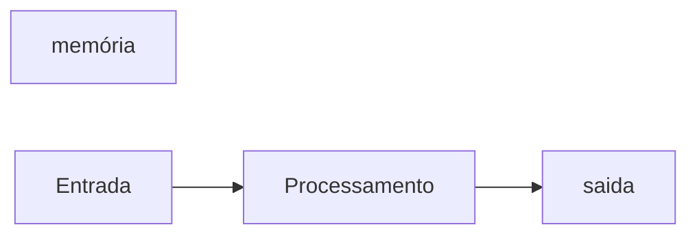

# JavaScript
Repositorio usado para estudo de logica de programação com uso da linguagem JAVA SCRIPT
## Autor
Ana silva 

---
## variaveis
variaveis são espaços na memoria do computador usados para guardar valores ao longo do programa
### Principais tipos primitivos:
- string ( texto)
- number (numeros inteiro e não inteiros)
- boolean (verdadeiro ou falso)

## Operadores Aritiméticos
| Operdador | Propósito | exemplo | resultado |
|-----------|-----------|---------|-----------|
| = | Atribuir um valor | x = 10 | x = 10 | 
| + | Somar | 10 + 5 | 15 |
|+= | Somar e Atribuir | x += 5 | x = 15 |
| - | Subtrair | 15 - 10 | 5 |
| -= | Subtrair e Atribuir | x -= 10 | x = 5 |
| * | Multiplicar | 5 * 4 | 20 | 
| *= | Multiplicação e Atribuir | x *= 4 | x = 20 |
| / | Dividir | 20 / 2 | 10 | 
| /= | Dividir e Atribuir | x /= 2 | 10 | 
| ++ | Somar 1 ao resultado | x++ | 11 |
| -- | Subtrair 1 do resultado | x-- | 10|
| % | Resto da Divisão | 10 % 3 | 1 | 

## operadores lógicos 
| operador | simbologia |
|----------|------------|
| AND | && |
| OR | \|\| |
| NOT | ! |

## comparadores
| comparador | significado | 
|------------|-------------|
| > | Maior que |
| >= | Maior ou igual a |
| < | Menor que |
|<= | Menor ou igual a |
| === | Identifico a |

