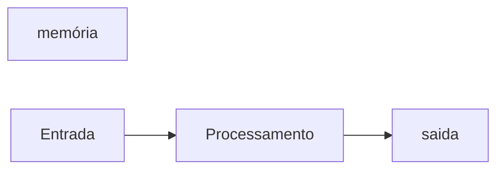

# JavaScript
Repositorio usado para estudo de logica de programação com uso da linguagem JAVA SCRIPT
## Autor
Ana silva 

---
## variaveis
variaveis são espaços na memoria do computador usados para guardar valores ao longo do programa
### Principais tipos primitivos:
- string ( texto)
- number (numeros inteiro e não inteiros)
- boolean (verdadeiro ou falso)

## Operadores Aritiméticos
| Operdador | Propósito | exemplo | resultado |
|-----------|-----------|---------|-----------|
| = | Atribuir um valor | x = 10 | x = 10 | 
| + | Somar | 10 + 5 | 15 |
|+= | Somar e Atribuir | x += 5 | x = 15 |
